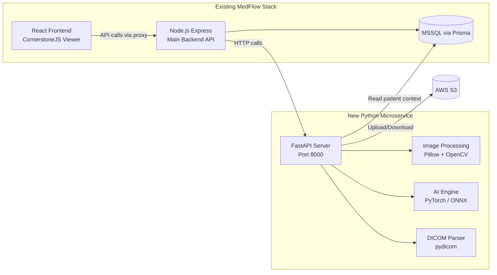
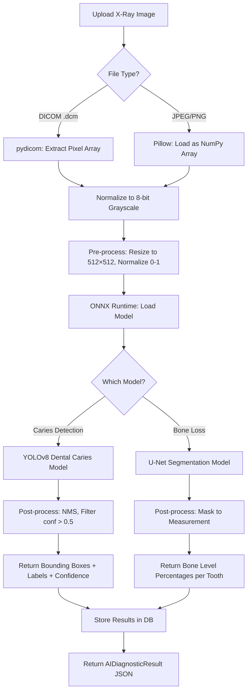

# MedFlow Imaging — Python Microservice Architecture
## Complete Implementation Plan

---

## 1. What Does the Imaging Software Do?

The MedFlow Imaging module is a **standalone Python microservice** that handles everything related to dental imaging. Your existing Node.js backend calls this service via HTTP. The React frontend renders images using CornerstoneJS but all processing, storage, and AI happens in Python.

### Complete Feature Map

| Category | Feature | Description |
|:---|:---|:---|
| **Upload & Storage** | Multi-format upload | Accept DICOM (.dcm), JPEG, PNG, TIFF via REST API |
| | S3 storage | Store originals + thumbnails in AWS S3 with practice-scoped paths |
| | Thumbnail generation | Auto-generate 200×200 previews using Pillow |
| | DICOM metadata extraction | Parse patient info, modality, study date from DICOM headers |
| **Image Processing** | Contrast enhancement | CLAHE (Contrast Limited Adaptive Histogram Equalization) for X-rays |
| | Noise reduction | Bilateral filtering to clean noisy X-ray scans |
| | Edge sharpening | Unsharp masking for clearer bone/tooth boundaries |
| | Auto window/level | Calculate optimal brightness/contrast values from pixel histogram |
| **AI Diagnostics** | Caries detection | Detect cavities/decay on bitewing and periapical X-rays |
| | Bone loss measurement | Measure periodontal bone levels around teeth |
| | Pathology highlighting | Return bounding boxes + confidence scores overlaid on images |
| | Report generation | Generate structured JSON diagnostic reports per image |
| **Organization** | Study management | Group images into studies (Full Mouth Series, Panoramic, etc.) |
| | Tooth linking | Tag images to specific tooth numbers (Universal 1-32 / FDI 11-48) |
| | Series comparison | Side-by-side before/after image retrieval |
| **Security** | Pre-signed URLs | Generate time-limited S3 download links (1hr expiry) |
| | Tenant isolation | Every query scoped by `practice_id` |
| | Audit logging | Log every upload, view, delete, AI inference event |

---

## 2. Why Python Microservice?



**Why this approach works:**

| Concern | Solution |
|:---|:---|
| AI/ML libraries only exist in Python | PyTorch, TensorFlow, scikit-image, OpenCV — all Python-native |
| DICOM parsing is mature in Python | `pydicom` is the gold standard, far ahead of JS alternatives |
| Image processing performance | NumPy + Pillow + OpenCV run C-optimized operations |
| Independent scaling | Scale the imaging service separately from your main API |
| Team isolation | Work on imaging without touching the Node.js codebase |
| Future-proof | Add new AI models by dropping `.onnx` files into a folder |

---

## 3. Tech Stack

| Layer | Library | Version | Purpose |
|:---|:---|:---|:---|
| **Framework** | FastAPI | 0.115+ | Async REST API with auto-generated Swagger docs |
| **Server** | Uvicorn | 0.30+ | ASGI server for FastAPI |
| **DICOM** | pydicom | 2.4+ | Parse DICOM files, extract metadata, pixel arrays |
| **Image Processing** | Pillow (PIL) | 10+ | Thumbnails, format conversion, basic transforms |
| **Image Processing** | OpenCV (cv2) | 4.9+ | CLAHE, denoising, edge detection, histogram analysis |
| **Image Processing** | NumPy | 1.26+ | Pixel array manipulation |
| **AI Inference** | ONNX Runtime | 1.17+ | Run trained dental AI models without PyTorch overhead |
| **AI Inference** | PyTorch (optional) | 2.2+ | Only needed if training/fine-tuning models |
| **Storage** | boto3 | 1.34+ | AWS S3 upload, download, pre-signed URL generation |
| **Database** | SQLAlchemy | 2.0+ | ORM for imaging tables (or direct MSSQL via pyodbc) |
| **Validation** | Pydantic | 2.7+ | Request/response schema validation (built into FastAPI) |
| **Testing** | pytest | 8+ | Unit and integration tests |
| **Containerization** | Docker | 24+ | Package service with all dependencies |

---

## 4. Directory Structure

```
medflow-imaging/
├── docker-compose.yml
├── Dockerfile
├── requirements.txt
├── .env.example
├── README.md
│
├── app/
│   ├── __init__.py
│   ├── main.py                    # FastAPI app entry point
│   ├── config.py                  # Environment config loader
│   │
│   ├── api/
│   │   ├── __init__.py
│   │   ├── router.py              # Main API router aggregator
│   │   ├── studies.py             # Study CRUD endpoints
│   │   ├── files.py               # File upload/download/delete endpoints
│   │   └── ai.py                  # AI inference endpoints
│   │
│   ├── models/
│   │   ├── __init__.py
│   │   ├── database.py            # SQLAlchemy engine & session
│   │   ├── imaging_study.py       # ImagingStudy ORM model
│   │   └── imaging_file.py        # ImagingFile ORM model
│   │
│   ├── services/
│   │   ├── __init__.py
│   │   ├── storage.py             # S3 upload, download, presigned URLs
│   │   ├── dicom_parser.py        # DICOM metadata extraction
│   │   ├── image_processor.py     # Thumbnails, CLAHE, denoising
│   │   └── ai_engine.py           # AI model loading & inference
│   │
│   ├── schemas/
│   │   ├── __init__.py
│   │   ├── study.py               # Pydantic request/response for studies
│   │   ├── file.py                # Pydantic request/response for files
│   │   └── ai.py                  # Pydantic AI inference results
│   │
│   └── ai_models/
│       ├── dental_caries_v1.onnx  # Pre-trained caries detection model
│       └── bone_loss_v1.onnx      # Pre-trained bone loss model
│
└── tests/
    ├── conftest.py
    ├── test_studies.py
    ├── test_files.py
    ├── test_dicom.py
    └── test_ai.py
```

---

## 5. REST API Specification

Base URL: `http://localhost:8000/api/v1/imaging`

### Studies

| Method | Endpoint | Body / Query | Response | Description |
|:---|:---|:---|:---|:---|
| GET | `/studies` | `?patient_id=&practice_id=` | `StudyListResponse` | List patient studies |
| POST | `/studies` | `StudyCreateRequest` | `StudyResponse` | Create new study |
| GET | `/studies/{id}` | — | `StudyDetailResponse` | Get study + files |
| PATCH | `/studies/{id}` | `StudyUpdateRequest` | `StudyResponse` | Update title/status |
| DELETE | `/studies/{id}` | — | `{success: true}` | Soft-delete |

### Files

| Method | Endpoint | Body / Query | Response | Description |
|:---|:---|:---|:---|:---|
| POST | `/files/upload` | `multipart/form-data` | `FileResponse` | Upload + thumbnail + metadata |
| GET | `/files/{id}/url` | — | `{url, expires_at}` | 1hr pre-signed S3 URL |
| GET | `/files/{id}/thumbnail` | — | `{url, expires_at}` | Thumbnail pre-signed URL |
| PATCH | `/files/{id}` | `FileUpdateRequest` | `FileResponse` | Update tooth#, notes |
| DELETE | `/files/{id}` | — | `{success: true}` | Delete file + S3 objects |
| GET | `/files/by-tooth/{patient_id}` | `?practice_id=` | `{tooth: [files]}` | Files grouped by tooth |

### Image Processing

| Method | Endpoint | Body | Response | Description |
|:---|:---|:---|:---|:---|
| POST | `/process/enhance` | `{file_id, operations[]}` | `{enhanced_url}` | Apply CLAHE, denoise, sharpen |
| POST | `/process/auto-windowlevel` | `{file_id}` | `{window_center, window_width}` | Calculate optimal W/L |
| GET | `/dicom/{file_id}/metadata` | — | `DicomMetadata` | Extract DICOM tags |

### AI Diagnostics

| Method | Endpoint | Body | Response | Description |
|:---|:---|:---|:---|:---|
| POST | `/ai/analyze` | `{file_id, model}` | `AIDiagnosticResult` | Run AI detection |
| GET | `/ai/models` | — | `[{name, version, type}]` | List available models |
| GET | `/ai/reports/{file_id}` | — | `[AIDiagnosticResult]` | Past AI results for file |

---

## 6. AI Pipeline Architecture



### AI Response Schema

```json
{
  "file_id": "abc-123",
  "model": "dental_caries_v1",
  "model_version": "1.0.0",
  "inference_time_ms": 342,
  "findings": [
    {
      "type": "CARIES",
      "tooth_number": 14,
      "confidence": 0.87,
      "severity": "MODERATE",
      "bounding_box": { "x": 120, "y": 85, "w": 45, "h": 38 },
      "description": "Interproximal caries detected on mesial surface"
    },
    {
      "type": "CARIES",
      "tooth_number": 15,
      "confidence": 0.72,
      "severity": "EARLY",
      "bounding_box": { "x": 210, "y": 92, "w": 30, "h": 25 },
      "description": "Early enamel demineralization on distal surface"
    }
  ],
  "summary": "2 carious lesions detected. Tooth #14 requires restorative treatment.",
  "disclaimer": "AI-assisted analysis. Not a clinical diagnosis. Must be reviewed by a licensed dentist."
}
```

---

## 7. Phase-by-Phase Implementation Roadmap

### Phase 1 — Foundation (Days 1–3)
> **Goal:** FastAPI server running, S3 connected, DICOM parsing works

- [ ] Initialize project: `mkdir medflow-imaging && cd medflow-imaging`
- [ ] Create virtual environment: `python -m venv venv`
- [ ] Install core deps: `pip install fastapi uvicorn boto3 pydicom pillow python-multipart sqlalchemy python-dotenv`
- [ ] Build `app/main.py` — FastAPI app with health check endpoint
- [ ] Build `app/config.py` — Load `.env` for S3 credentials, DB connection
- [ ] Build `app/services/storage.py` — S3 upload, download, pre-signed URL generation
- [ ] Build `app/services/dicom_parser.py` — Extract metadata from `.dcm` files using pydicom
- [ ] Build `app/models/database.py` — SQLAlchemy engine connecting to MSSQL
- [ ] Build `app/models/imaging_study.py` and `imaging_file.py` — ORM models
- [ ] Test: Upload a `.dcm` file → stored in S3 → metadata extracted → saved to DB

### Phase 2 — CRUD & Image Processing (Days 4–6)
> **Goal:** Full study/file CRUD, thumbnail generation, image enhancement

- [ ] Build `app/api/studies.py` — All study CRUD endpoints
- [ ] Build `app/api/files.py` — Upload, URL generation, metadata update, delete
- [ ] Build `app/services/image_processor.py`:
  - `generate_thumbnail(image_bytes) → thumbnail_bytes` (200×200 JPEG)
  - `apply_clahe(image_array) → enhanced_array` (contrast enhancement)
  - `denoise(image_array) → cleaned_array` (bilateral filter)
  - `auto_window_level(dicom_pixels) → {center, width}` (histogram analysis)
- [ ] Build `app/api/router.py` — Aggregate all route modules
- [ ] Build Pydantic schemas for request/response validation
- [ ] Write pytest tests for upload, retrieve, delete flows

### Phase 3 — AI Engine (Days 7–10)
> **Goal:** AI inference pipeline running with pre-trained or placeholder models

- [ ] Install AI deps: `pip install onnxruntime opencv-python numpy`
- [ ] Build `app/services/ai_engine.py`:
  - Model registry: scan `ai_models/` folder for `.onnx` files
  - Pre-processing pipeline: resize, normalize, convert to tensor
  - Inference: run through ONNX Runtime session
  - Post-processing: NMS for detection, threshold filtering
- [ ] Build `app/api/ai.py` — `/ai/analyze`, `/ai/models`, `/ai/reports/{file_id}`
- [ ] Build `app/schemas/ai.py` — `AIDiagnosticResult` Pydantic model
- [ ] Create a placeholder/dummy ONNX model for testing the full pipeline
- [ ] Later: swap in a real dental caries YOLOv8 model (train or download)

### Phase 4 — Docker & Integration (Days 11–14)
> **Goal:** Containerized service ready for your Node.js backend to call

- [ ] Write `Dockerfile` (Python 3.11-slim, install deps, copy app)
- [ ] Write `docker-compose.yml` (service + environment variables)
- [ ] Write `.env.example` with all required config keys
- [ ] Add CORS middleware to FastAPI for direct frontend calls during dev
- [ ] Document all endpoints in auto-generated Swagger (`/docs`)
- [ ] Integration test: Node.js backend calls Python service → returns results
- [ ] Write `README.md` with setup, run, and deploy instructions

---

## 8. Key Code Patterns

### FastAPI Entry Point

```python
# app/main.py
from fastapi import FastAPI
from fastapi.middleware.cors import CORSMiddleware
from app.api.router import api_router
from app.config import settings

app = FastAPI(
    title="MedFlow Imaging Service",
    description="Dental imaging microservice with AI diagnostics",
    version="1.0.0",
)

app.add_middleware(
    CORSMiddleware,
    allow_origins=settings.CORS_ORIGINS,
    allow_methods=["*"],
    allow_headers=["*"],
)

app.include_router(api_router, prefix="/api/v1/imaging")

@app.get("/health")
async def health():
    return {"status": "ok", "service": "medflow-imaging"}
```

### S3 Storage Service

```python
# app/services/storage.py
import boto3
from botocore.config import Config
from app.config import settings

class StorageService:
    def __init__(self):
        self.s3 = boto3.client("s3",
            region_name=settings.AWS_REGION,
            aws_access_key_id=settings.AWS_ACCESS_KEY_ID,
            aws_secret_access_key=settings.AWS_SECRET_ACCESS_KEY,
        )
        self.bucket = settings.AWS_S3_BUCKET

    async def upload(self, file_bytes: bytes, s3_key: str, content_type: str):
        self.s3.put_object(Bucket=self.bucket, Key=s3_key, Body=file_bytes, ContentType=content_type)

    async def get_presigned_url(self, s3_key: str, expires_in: int = 3600) -> str:
        return self.s3.generate_presigned_url(
            "get_object",
            Params={"Bucket": self.bucket, "Key": s3_key},
            ExpiresIn=expires_in,
        )

    async def delete(self, s3_key: str):
        self.s3.delete_object(Bucket=self.bucket, Key=s3_key)
```

### DICOM Parser

```python
# app/services/dicom_parser.py
import pydicom
import numpy as np
from io import BytesIO

class DicomParser:
    @staticmethod
    def extract_metadata(file_bytes: bytes) -> dict:
        ds = pydicom.dcmread(BytesIO(file_bytes))
        return {
            "patient_name": str(getattr(ds, "PatientName", "")),
            "modality": str(getattr(ds, "Modality", "")),
            "study_date": str(getattr(ds, "StudyDate", "")),
            "rows": int(getattr(ds, "Rows", 0)),
            "columns": int(getattr(ds, "Columns", 0)),
            "bits_allocated": int(getattr(ds, "BitsAllocated", 0)),
            "photometric": str(getattr(ds, "PhotometricInterpretation", "")),
        }

    @staticmethod
    def get_pixel_array(file_bytes: bytes) -> np.ndarray:
        ds = pydicom.dcmread(BytesIO(file_bytes))
        pixels = ds.pixel_array.astype(np.float32)
        # Normalize to 0-255 range
        pixels = ((pixels - pixels.min()) / (pixels.max() - pixels.min()) * 255).astype(np.uint8)
        return pixels
```

### AI Engine

```python
# app/services/ai_engine.py
import onnxruntime as ort
import numpy as np
import cv2
from pathlib import Path

class AIEngine:
    def __init__(self):
        self.models = {}
        self._load_models()

    def _load_models(self):
        model_dir = Path(__file__).parent.parent / "ai_models"
        for onnx_file in model_dir.glob("*.onnx"):
            name = onnx_file.stem
            self.models[name] = ort.InferenceSession(str(onnx_file))

    def analyze(self, pixel_array: np.ndarray, model_name: str) -> dict:
        if model_name not in self.models:
            raise ValueError(f"Model '{model_name}' not found")

        session = self.models[model_name]
        # Pre-process: resize to model input size, normalize
        img = cv2.resize(pixel_array, (512, 512))
        img = img.astype(np.float32) / 255.0
        img = np.expand_dims(img, axis=(0, 1))  # [1, 1, 512, 512]

        # Run inference
        input_name = session.get_inputs()[0].name
        outputs = session.run(None, {input_name: img})

        # Post-process outputs into findings
        return self._post_process(outputs, model_name)

    def _post_process(self, outputs, model_name: str) -> list:
        # Model-specific post-processing logic
        findings = []
        # ... parse bounding boxes, confidence scores, labels
        return findings

    def list_models(self) -> list:
        return [{"name": k, "status": "loaded"} for k in self.models]
```

---

## 9. How Node.js Backend Calls This Service

Your existing Express backend proxies requests to the Python microservice:

```javascript
// In your Node.js backend: services/imagingProxy.js
const axios = require("axios");
const IMAGING_SERVICE_URL = process.env.IMAGING_SERVICE_URL || "http://localhost:8000";

const imagingProxy = {
  async uploadFile(fileBuffer, metadata) {
    const formData = new FormData();
    formData.append("file", new Blob([fileBuffer]), metadata.fileName);
    formData.append("study_id", metadata.studyId);
    formData.append("patient_id", metadata.patientId);
    formData.append("practice_id", metadata.practiceId);

    const res = await axios.post(`${IMAGING_SERVICE_URL}/api/v1/imaging/files/upload`, formData);
    return res.data;
  },

  async runAI(fileId, modelName) {
    const res = await axios.post(`${IMAGING_SERVICE_URL}/api/v1/imaging/ai/analyze`, {
      file_id: fileId,
      model: modelName,
    });
    return res.data;
  },

  async getPresignedUrl(fileId) {
    const res = await axios.get(`${IMAGING_SERVICE_URL}/api/v1/imaging/files/${fileId}/url`);
    return res.data;
  },
};

module.exports = imagingProxy;
```

---

## 10. Deployment Architecture

```
┌─────────────────────────────────────────────────┐
│                Production Setup                  │
├─────────────────────────────────────────────────┤
│                                                  │
│  [React Frontend]  ──→  [Node.js API :3001]     │
│        │                       │                 │
│        │                       ▼                 │
│        │              [Python Imaging :8000]     │
│        │                   │       │             │
│        ▼                   ▼       ▼             │
│  [CornerstoneJS]     [AWS S3]  [MSSQL DB]       │
│  (browser render)                                │
│                                                  │
│  Docker Compose runs both services together      │
└─────────────────────────────────────────────────┘
```

```yaml
# docker-compose.yml
version: "3.8"
services:
  imaging-service:
    build: .
    ports:
      - "8000:8000"
    env_file: .env
    volumes:
      - ./app/ai_models:/app/ai_models
    restart: unless-stopped
```
